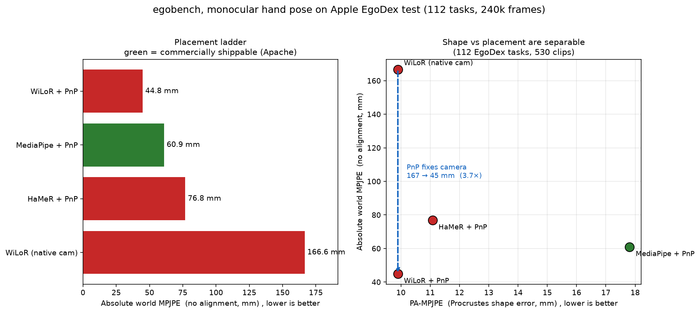
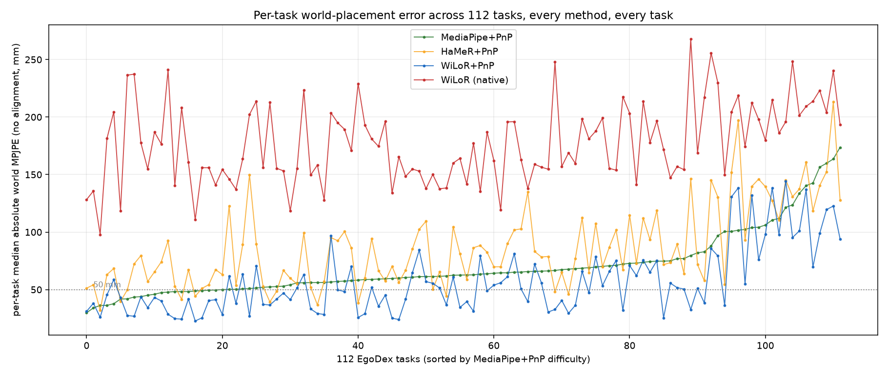
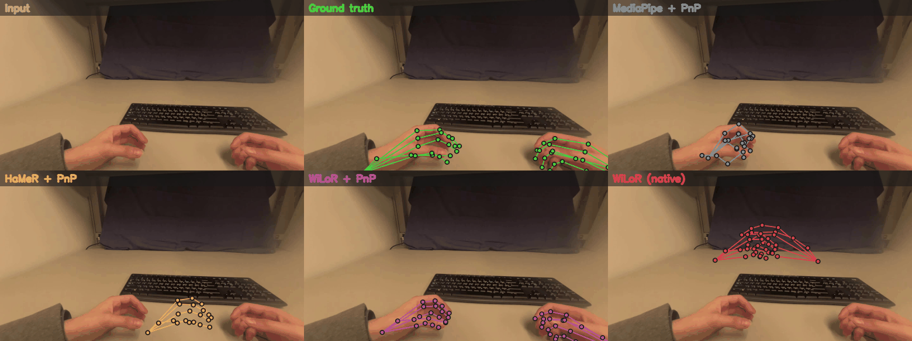

# egobench

**A reproducible, license-aware comparison of off-the-shelf hand trackers for metric-scale, world-frame hand pose from egocentric video.**

> **Headline finding.** Off-the-shelf hand nets (HaMeR, WiLoR) reconstruct good hand *shape* but regress *broken metric placement*. Adding a classical **PnP** step (using the camera's known intrinsics) recovers world placement up to **3.7×** (167→45 mm) with zero training. **Geometry matters more than which network you pick:** once PnP is added, a free 2020 **Apache** model (MediaPipe, **61 mm**) lands within ~16 mm of the non-commercial SOTA (WiLoR+PnP, **45 mm**) while being the **only commercially-deployable** option. *What this measures:* hand placement in the dataset's world frame **given its calibrated camera** (this is not camera-pose estimation); metric scale comes from an assumed average hand, so all methods under-scale ~7%. Full numbers and caveats below.

Most hand-pose papers report **PA-MPJPE**, a Procrustes-aligned, *shape-only* score that aligns away every millimetre of world-placement error. If you are building a data pipeline that needs the hand's **actual position in the world** (robot imitation, action data, HOI), that number tells you almost nothing. egobench measures the thing that gets hidden: **absolute world-frame placement**, on real ground truth, per task, with **licenses front-and-centre**, because *which model you may legally deploy commercially* is a first-class constraint, not a footnote.

This is **not** a new model, a new metric, or a claim to be first at world-space hand estimation (that is an active area, see [Related work](#related-work)). It is an honest, runnable head-to-head of the tools practitioners actually reach for.



---

## TL;DR

4 methods, **112 EgoDex tasks, 530 clips, ~240k scored hand-frames** (Apple Vision Pro / ARKit ground truth).

| Method | Absolute world MPJPE ↓ | PA-MPJPE ↓ | frames <100 mm | Model license | Deployable on your own data? |
|---|---|---|---|---|---|
| WiLoR + PnP | **44.8 mm** | **9.9 mm** | 89 % | CC-BY-NC-ND | ❌ |
| **MediaPipe + PnP** | 60.9 mm | 17.8 mm | 76 % | **Apache-2.0** | ✅ |
| HaMeR + PnP | 76.8 mm | 11.1 mm | 63 % | NC (MANO) | ❌ |
| WiLoR (native camera) | 166.6 mm | 9.9 mm | 9 % | CC-BY-NC-ND | ❌ |

> "Absolute world MPJPE" = mean per-joint L2 in the world frame with **no alignment** (raw placement). This is **not** the community's first-frame-aligned *W-MPJPE* (see [Metrics](#metrics)). PA-MPJPE is full-Procrustes (shape only).

**Three takeaways:**

1. **PnP is the story, not the network.** WiLoR's own regressed camera places hands at 166.6 mm; the *same keypoints* through `cv2.solvePnP` land at 44.8 mm, a **3.7× fix**. Off-the-shelf hand nets predict good hand *shape* and *broken metric translation*; a classical geometry step recovers placement.
2. **The only commercially-deployable model is competitive.** MediaPipe+PnP (Apache-2.0, 60.9 mm) beats WiLoR-as-shipped (166.6 mm) and HaMeR (76.8 mm). The absolute best (WiLoR+PnP, 44.8 mm) is **non-commercial** (CC-BY-NC-ND), so the real "commercial-safety tax" is ~16 mm, not a cliff.
3. **Everything under-scales hands ~7 %** (relative scale error −0.067 to −0.074 across all four). Monocular hands come out consistently small.

## Scope, what this repo actually contains today

egobench is a hand-pose benchmark **right now**. The camera-trajectory half (world-frame drift, ATE) and additional GT sources are scaffolded but **not yet run**, they are on the [roadmap](#roadmap), not in the numbers above. The table reflects exactly what was executed: 4 hand-pose methods on the EgoDex test split.

---

## Why this exists

Building physical-AI data from human video needs the hand in **metric world coordinates**. Two gaps make model selection hard:

- **The reported metric hides placement.** PA-MPJPE (and even first-frame-aligned W-MPJPE) remove global translation/scale. A method can look great on paper and drift half a hand-length in world space.
- **Licenses are ignored.** A model you cannot legally deploy commercially is a research toy for a data company. MANO, HaMeR-via-MANO, and WiLoR are non-commercial; MediaPipe is Apache. That distinction decides what you can build a product on.

A note on ground-truth integrity, since it is easy to get wrong: several "egocentric hand" datasets publish hand annotations that are themselves a **model output** (e.g. a WiLoR/MANO fit), not a sensor measurement. Benchmarking a model against another model's output measures agreement, not accuracy. egobench deliberately scores against **EgoDex's on-device Vision Pro tracking**, an actual sensor measurement, and treats model-derived annotations as *not* ground truth.

## Metrics

| Metric | Alignment | Measures | Note |
|---|---|---|---|
| **Absolute world MPJPE** *(headline)* | none | raw metric placement in world frame | **≠** community W-MPJPE |
| PA-MPJPE | full Procrustes (scale+R+t) | hand shape only | for contrast |
| relative scale error | n/a | systematic hand-size bias | signed |

⚠️ **Naming honesty:** in the egocentric literature "W-MPJPE" usually means *world MPJPE after a first-frame similarity alignment* (drift), as in [EgoAllo](https://arxiv.org/abs/2410.03665) / [StableHand](https://arxiv.org/abs/2605.18553). We report the stricter **no-alignment** absolute error and name it as such to avoid confusion. Adding the aligned W-MPJPE / WA-MPJPE variants for direct comparability is on the [roadmap](#roadmap).

## Results

Full aggregates: [`results/summary.csv`](results/summary.csv). Per-task medians for all 112 tasks × 4 methods: [`results/per_task.csv`](results/per_task.csv).



Per-task placement error spans **30 → 174 mm** and is interpretable:

- **Hardest** (MediaPipe): `fidget_magnetic_spinner_rings` (174), `braid_unbraid` (163), `write` (160), `stack_remove_jenga` (156), fast rotation, self-occlusion, fine motion near the body.
- **Easiest**: `wrapping` (30), `type_keyboard` (34), `fold_unfold_paper_origami` (36), `stack_unstack_tupperware` (42), large, clear, table-top motion.

### Qualitative, placement you can see



Each method's predicted 3D hand is **reprojected onto the frame through the true camera** (skeletons, no MANO mesh). A method with bad world placement lands *off* the hand, so the millimetre numbers become visible. **WiLoR's native output (red) floats off the hand entirely** (the 167 mm error), while the *same keypoints* through PnP (purple) land on it. Animated at 1 s/frame; a static 3-frame stack is in [`results/qualitative_frames.png`](results/qualitative_frames.png). Reproduce with `python scripts/viz_frames.py`.

## Reproduce

```bash
# 1. Environment (Python 3.12; see scripts/ for exact pins)
python3.12 -m venv venv && source venv/bin/activate
pip install torch torchvision mediapipe h5py scipy opencv-python numpy matplotlib
#   + HaMeR / WiLoR weights, see their repos (licenses below)

# 2. Data, Apple EgoDex test split (16 GB, all 112 tasks). CC-BY-NC-ND: research use.
curl "https://ml-site.cdn-apple.com/datasets/egodex/test.zip" -o test.zip
unzip test.zip -d data/egodex        # -> data/egodex/test/<task>/<n>.hdf5 + .mp4

# 3. Score (stride 5; two-pass so it fits a 6 GB GPU)
EGOBENCH_FRAME_STRIDE=5 python scripts/run_benchmark.py \
    --datasets egodex --methods all --out outputs/bench_egodex_local.jsonl

# 4. Analytics + figures
python scripts/analyze_interim.py                 # console tables
python scripts/export_results.py                  # results/*.csv + per_task_W.png
python scripts/plot_thesis.py                     # outputs/thesis_plot.png
```

Released artifacts (this repo is a benchmark, not a model, there are no weights to ship): the full per-frame scores ([`results/bench_egodex_local.jsonl.gz`](results/bench_egodex_local.jsonl.gz), ~240k rows), the per-task CSVs, and pinned model versions for exact reproducibility.

## Datasets & Models, licenses and attribution

**Please cite the upstream work if you use egobench.** Every non-commercial component is tagged. **egobench as a whole is a research artifact**, EgoDex itself is non-commercial, so nothing here may be used to build a commercial product; the "deployable" column refers only to running a given *model* on your *own* commercially-licensed footage.

| Component | Role | License | Commercial deploy |
|---|---|---|---|
| **Apple EgoDex** | dataset + ground truth | **CC-BY-NC-ND** | ❌ (research only) |
| **MediaPipe Hands** (Google) | hand keypoints | Apache-2.0 | ✅ |
| **HaMeR** (code) | hand mesh | MIT | code ✅ |
| **MANO** (used by HaMeR) | hand model | **Non-commercial research** | ❌ |
| **WiLoR** | hand localization + mesh | **CC-BY-NC-ND** | ❌ |
| SQPnP (`cv2.solvePnP`) | metric placement | OpenCV (BSD/Apache) | ✅ |
| **egobench** (this repo) | evaluation harness | MIT | ✅ |

Citations:

- **EgoDex**, *EgoDex: Learning Dexterous Manipulation from Large-Scale Egocentric Video*, Apple, arXiv:[2505.11709](https://arxiv.org/abs/2505.11709), code: [apple/ml-egodex](https://github.com/apple/ml-egodex). Dataset: CC-BY-NC-ND.
- **HaMeR**, Pavlakos, Shan, Radosavovic, Kanazawa, Fouhey, Malik, *Reconstructing Hands in 3D with Transformers*, CVPR 2024, arXiv:[2312.05251](https://arxiv.org/abs/2312.05251).
- **WiLoR**, Potamias, Zhang, Deng, Zafeiriou, *WiLoR: End-to-end 3D Hand Localization and Reconstruction in-the-wild*, CVPR 2025 (Imperial College London / SJTU). License: CC-BY-NC-ND.
- **MediaPipe Hands**, Zhang et al., *MediaPipe Hands: On-device Real-time Hand Tracking*, arXiv:[2006.10214](https://arxiv.org/abs/2006.10214).
- **MANO**, Romero, Tzionas, Black, *Embodied Hands: Modeling and Capturing Hands and Bodies Together*, SIGGRAPH Asia 2017. Non-commercial license.
- **SQPnP**, Terzakis, Lourakis, *A Consistently Fast and Globally Optimal Solution to the Perspective-n-Point Problem*, ECCV 2020.

## Related work

egobench does **not** claim to be first at world-space egocentric hand estimation. It is a practitioner-facing comparison layered with a licensing lens. Prior/parallel work on world-frame hand & body motion from egocentric video includes
[EgoAllo (Estimating Body and Hand Motion in an Ego-sensed World)](https://arxiv.org/abs/2410.03665),
[StableHand](https://arxiv.org/abs/2605.18553),
and [EgoGrasp](https://arxiv.org/abs/2601.01050),
plus the [HOT3D / AssemblyHands](https://arxiv.org/abs/2403.16428) hand-object interaction benchmarks.

## Roadmap

- [ ] **Aligned metrics**, add first-frame-aligned W-MPJPE and WA-MPJPE for direct comparability with the egocentric literature.
- [ ] **Camera-trajectory half**, world-frame drift / ATE (SE(3) and Sim(3) aligned; the gap = scale) against a reference camera-GT source, so the benchmark covers both hand *and* camera placement.
- [ ] **More datasets**, HOT3D (Meta/Aria) and AssemblyHands loaders (both have GT hand pose), to test cross-dataset generalization and selection bias.
- [ ] **Per-clip confidence / failure detection**, reprojection residual, temporal jerk, occlusion fraction, detection dropout, correlated against actual world error (ship a confidence score, not just a mean).
- [ ] **Trajectory visualizations**, predicted vs GT wrist path over time, with drift and scale error annotated per clip.
- [ ] **Task-label normalization**, reconcile clip-metadata labels vs directory names (currently 112 labels / 111 dirs).

## Known limitations (read before quoting numbers)

- **We score hand placement *given* the camera, not camera estimation.** All methods are placed in the world frame using the dataset's GT camera pose, and the PnP methods use the camera's **known intrinsics**. The native-camera baseline (WiLoR native) instead uses the model's own regressed weak-perspective camera. So "MediaPipe+PnP (61 mm) vs WiLoR native (167 mm)" is *pipeline vs pipeline*, not model vs model, and the fair same-model comparison is WiLoR native 167 → WiLoR+PnP 45.
- **WiLoR and HaMeR are reconstruction models, not metric-world estimators.** They are optimized for image-aligned shape; their native world numbers reflect that they were never built to output metric world placement, not that the models are weak. The point is that a classical PnP wrapper supplies what they lack.
- **Metric scale comes from an assumed average hand template** (PnP needs a metric 3D model), not from the image, which is why all four methods systematically under-scale ~7%.
- Metrics are **per-frame pooled** (long clips weigh more); macro medians (median-of-per-task-medians) are reported alongside and agree within ~2 mm.
- Sampling is **5 episodes/task at frame-stride 5**, validated to hold task medians within 1–3 mm vs full-rate, but it is a subsample, not the whole 3243-clip test set.
- The best method overall (**WiLoR+PnP, 45 mm**) is **non-commercial** (CC-BY-NC-ND); it is not "ours to claim." WiLoR / HaMeR / MANO numbers are reference only.

## Citing egobench

```bibtex
@misc{egobench2026,
  title  = {egobench: a license-aware benchmark for metric-scale world-frame hand pose from egocentric video},
  author = {Basani, Ashwath},
  year   = {2026},
  url    = {https://github.com/stray128/egoBench}
}
```

## License

Code: **MIT** (see [LICENSE](LICENSE)). Evaluated models and datasets retain their own licenses (table above), egobench does not redistribute any model weights or dataset content.
